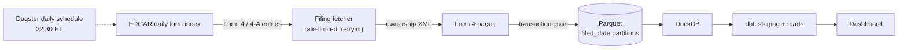

# edgar-pipeline

Incremental pipeline over SEC EDGAR Form 4 filings (insider transactions): daily index discovery → ownership-XML parsing → partitioned Parquet → DuckDB + dbt models, orchestrated with Dagster.



## Why this design

**Daily-partitioned, idempotent ingestion.** Each filed date is one Dagster partition producing one Parquet file, written atomically. Re-materializing a partition overwrites it cleanly, so backfills and re-runs are safe by construction. Weekends and holidays (no EDGAR index → 404) become empty partitions, keeping the partition set dense.

**Amendments handled in the modeling layer.** A Form 4/A supersedes the filing it amends — a textbook late-arriving-data problem. Raw Parquet stays immutable and append-only; `stg_form4_transactions` resolves supersession with a window function, so the rule is explicit, testable, and revisable without re-ingesting anything.

**Nulls mean "not stated."** Footnoted prices (common on gifts and grants) parse to `NULL`, never `0.0`. Downstream value aggregations therefore exclude them by SQL semantics instead of silently corrupting totals.

**Fair-access compliance.** The SEC caps clients at 10 req/s and requires an identifying User-Agent. The shared client enforces a limit below the cap with backoff on 429/5xx, and refuses to start without `EDGAR_USER_AGENT` set.

**Parsers are tested against fixtures.** Acquisition code rots where the source's format lives; the daily-index and Form 4 parsers are covered by saved-fixture tests (including the no-price and amendment paths) so format drift is caught by CI, not in production.

## Quick start

```bash
make setup && source .venv/bin/activate
cp .env.example .env   # put your name/email in EDGAR_USER_AGENT
make test

# one-day end-to-end run against live EDGAR, then a DuckDB summary:
EDGAR_USER_AGENT="Your Name you@example.com" make smoke DATE=2026-07-15

# Dagster UI (materialize partitions, inspect runs, enable the schedule):
make dev
```

## Layout

```
src/edgar_pipeline/
  http.py          rate-limited retrying EDGAR client
  daily_index.py   daily form-index fetch + fixed-width parse (offsets derived from header)
  form4.py         ownership-XML discovery (via filing index.json) and parsing
  models.py        pydantic records; flatten() defines the warehouse grain
  storage.py       atomic Parquet partition writes; DuckDB view over the lake
  definitions.py   Dagster assets (daily partitions) + 22:30 ET weekday schedule
  smoke.py         single-day end-to-end CLI, no orchestrator needed
dbt/               duckdb-backed staging + marts (amendment resolution, insider flows)
tests/             fixture-driven parser, storage, and index tests
```

## Roadmap

13F institutional holdings ingestion (same platform, quarterly partitions), an Evidence dashboard over `fct_insider_flows`, S&P 500 issuer enrichment, and a nightly Excel export of notable insider activity.

## Data source

All data comes from the SEC's public EDGAR system per its [fair-access guidelines](https://www.sec.gov/os/accessing-edgar-data). No scraping of rate-limited or access-controlled endpoints; bulk and index endpoints only.
